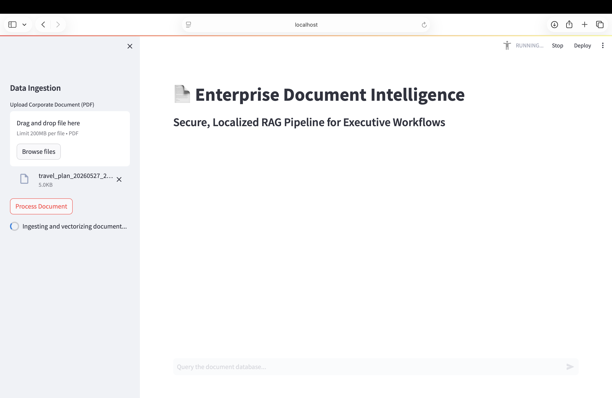
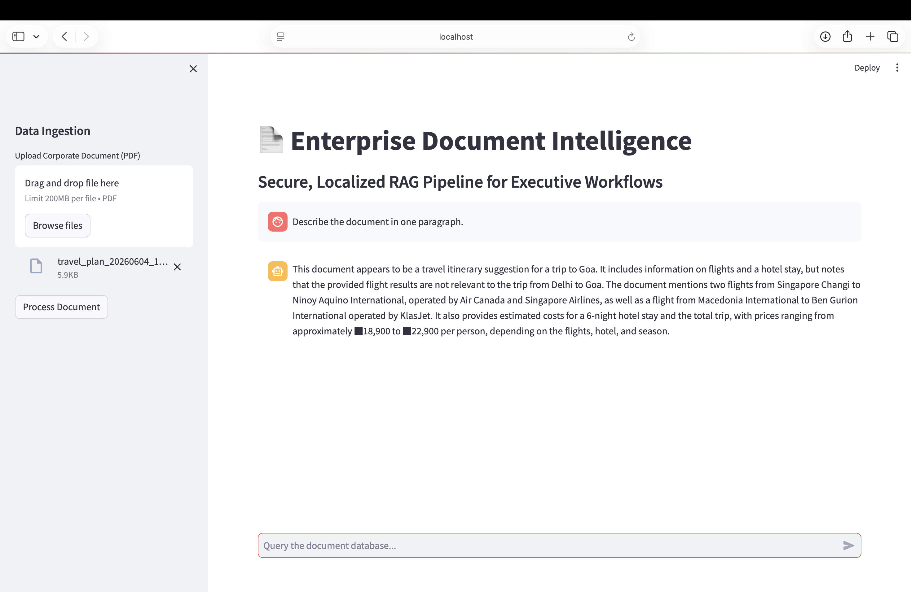

# 📄 Enterprise Document Intelligence (RAG Pipeline)


---

## 📌 Overview

Enterprise Document Intelligence is a Retrieval-Augmented Generation (RAG) application that enables users to ask natural language questions about PDF documents.

The application extracts text from uploaded PDFs, generates semantic embeddings using a local Hugging Face model, stores them in a FAISS vector index, retrieves relevant document chunks, and sends only the retrieved context to a large language model through the Groq API to generate responses.

---

## Demo

### Upload PDF



### Ask Questions



---

## ✨ Features

- PDF document upload
- Automatic text extraction
- Local embedding generation
- FAISS vector search
- Context-aware question answering
- Interactive Streamlit interface
- Modular RAG pipeline

---

## 🏗 Architecture

```
PDF Upload
      │
      ▼
Text Extraction
      │
      ▼
Text Chunking
      │
      ▼
Hugging Face Embeddings
      │
      ▼
FAISS Vector Store
      │
      ▼
Similarity Search
      │
      ▼
Retrieved Context
      │
      ▼
Groq LLM
      │
      ▼
Generated Answer
```

---

## 🛠 Tech Stack

| Component | Technology |
|------------|------------|
| Language | Python |
| Frontend | Streamlit |
| Framework | LangChain |
| Embeddings | all-MiniLM-L6-v2 |
| Vector Database | FAISS |
| LLM | Mixtral-8x7B via Groq |
| PDF Processing | PyPDF2 |

---

## 📂 Project Structure

```
enterprise-doc-intelligence/

├── app.py
├── config.py
├── prompt_templates.py
├── requirements.txt
├── screenshots/
├── utils/
└── README.md
```

---

## ⚙️ Installation

```bash
git clone https://github.com/yourusername/enterprise-doc-intelligence.git

cd enterprise-doc-intelligence

python -m venv .venv

source .venv/bin/activate

pip install -r requirements.txt

# Add your GROQ_API_KEY to a .env file

streamlit run app.py
```

---

## 🚀 How It Works

1. Upload one or more PDF documents.
2. Extract document text.
3. Split text into manageable chunks.
4. Generate semantic embeddings locally.
5. Store embeddings in a FAISS vector index.
6. Retrieve the most relevant chunks for a query.
7. Send the retrieved context to the Groq LLM.
8. Display the generated answer.

---

## 📈 Resume Highlights

- Built an end-to-end Retrieval-Augmented Generation (RAG) application using LangChain, FAISS, and Groq.
- Implemented local semantic embedding generation using Hugging Face models to reduce reliance on external embedding services.
- Designed a modular document-processing pipeline for PDF ingestion, retrieval, and question answering.
- Developed an interactive Streamlit interface for document analysis using natural language queries.

---

## 🔮 Future Improvements

- Pinecone or Qdrant integration
- Docker deployment
- User authentication
- Role-based access control
- AWS S3 document storage
- REST API
- Citation highlighting
- Multi-document chat history

---

## 📄 License

MIT License
